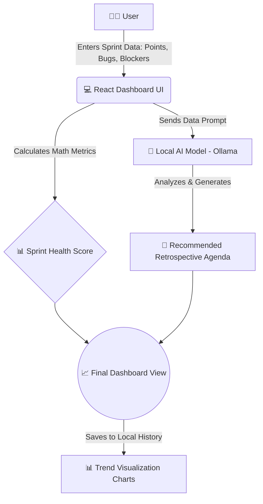

# AI Sprint Health Dashboard

**AI Sprint Health Dashboard** is a smart, interactive web application designed to help Agile development teams instantly understand how well their sprints are performing. 

Instead of manually analyzing spreadsheets, you just input your sprint data (like completed points, story changes, and bugs), and the application uses local Artificial Intelligence to evaluate your sprint's health and suggest improvements.

### 🌟 Key Features in Simple Terms:
- **Instant Health Score:** It calculates a simple health score and gives your sprint a status (Red, Amber, or Green) based on how well the sprint went.
- **AI-Powered Retrospective:** It sends your sprint details to a local AI model (Ollama), which acts like an Agile Coach. The AI automatically generates a customized agenda and talking points for your next team retrospective meeting.
- **Trend Tracking:** It saves your past sprints and uses charts to show if your team is improving over time.

---

### 🗺️ How It Works (Architecture Diagram)

---

### 🚀 Built With
* **React** & **Vite** - For a fast, responsive user interface.
* **Tailwind CSS** - For beautiful, professional styling.
* **Recharts** - For interactive historical trend charts.
* **Ollama (Local LLM)** - For secure, private, AI-generated insights without sending data to the cloud.
